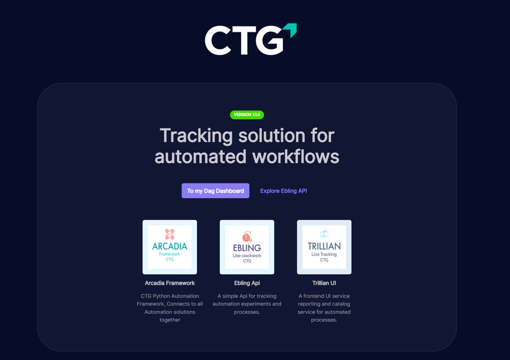
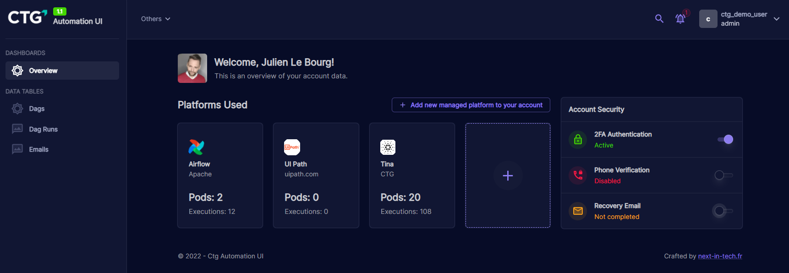
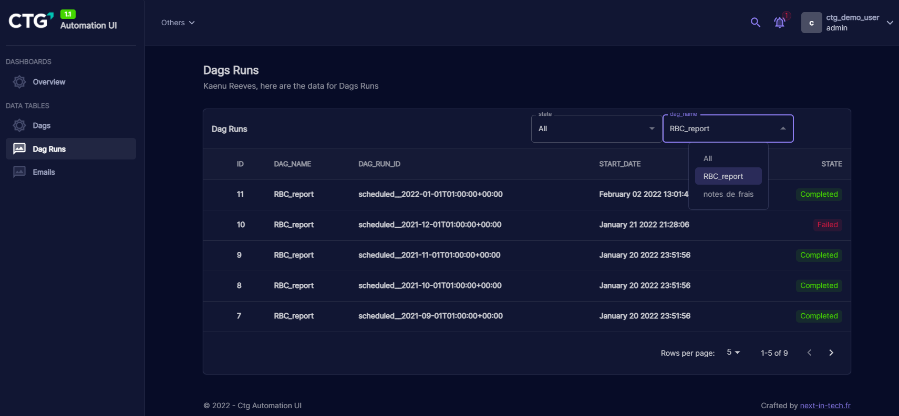

# Automation

## I have created an automation Framework:

Recently, I've built a new solution that integrates all automated processes and ETL components into a centralized API and framework, while keeping all data on premise.

!!! Note "Components"

    - **Trillian**: A dashboard for viewing and monitoring automated workflows, reporting and billing information.
    - **Arcadia**: A collection of plugins and libraries to be used in automation solutions like airflow, perfect and dagster
    - **Ebling**: The backend for storage of all required data, integrated with Arcadia and Trillian and easy to integrate with other automation systems thanks to a simple REST API.


### Central Single Sign on system / Double Authentication

A Keycloak instance is setup for single sign on accross all services.
It is the source of truth for all incoming connections and all services are integrated with the <a href="https://openid.net/connect/" class="external-link" target="_blank">Oauth2/OIDC</a> protocol, providing a high level of security accross all services.

### Machine Learning

One machine learning experiment have been setup as a demonstation, it is a document classifier based on a scanned document or a picture (Like from Office lense app)

### Production Ready

Everything is orchestrated with Kubernetes and provides a full set of Rest APIs.

!!! Note "Other optional infrastructural components"

    - **Airflow** & **dagster**: Example of integrated automation systems
    - **ML Flow** to track machine learning experiments that can be called by the **Arcadia** framework during a workflow
    - **Minio S3** : to store machine learning artifacts, using Amazon S3 protocol.


### UI Screenshots:





### Airflow plugin implemntation example (EmailSensor using a custom connector):

```python

@dag(schedule_interval=timedelta(days=1), start_date=datetime(2021, 1, 20), catchup=False)
def monitoring_system_report_automation():
    
    # this sensor allows to only run this workflow if an email that responds to the email_filter specified is found
    check_for_monitoring_event = EmailSensor(task_id="get_monitoring_reports_email", email_filter=email_filter)
    
    @task(task_id='get_monitoring_reports_email')
    def get_emails() -> List[Message]:
        emails = email_filter.get_emails()
        return emails

    @task(task_id="save_csv_in_database")
    def save_csv_in_database(emails: List[Message]) -> None:
        for email in emails:
            for attachment in email.attachments:
                save_reports(attachment)
    
    emails = get_emails() # get task objects from decorated function
    emails_to_backend = save_csv_in_database(emails) # get task objects from decorated function
    
    check_for_monitoring_event >> emails >> emails_to_backend # specify order of execution 

save_monitoring_reports = monitoring_system_report_automation()
```

## My main automation skills

???+ Danger "Tools and techniques"
    Mostly worked with Airflow, but also know with dagster & perfect

    - [X] Building Dags - ETLs
    - [X] Creating Plugins
    - [X] Deployment and Administration
