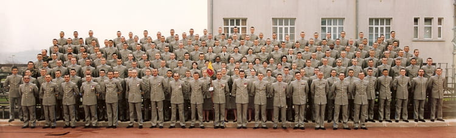

# About Me

## Hobbies

- Traveling
- Technology
- Music
- Chess
- Sharing Knowledge
- Celebrating Successes

## why an online Resume / portfolio:

I wanted a way to expose my approach to the tech world. and you cannot easily lie on an online portfolio / CV can you ?

## Past Life

???- Info "Past Life"
    I left school to follow my dreams and travel the world, entering the army, which has built my character and reinforced my discipline.

    !!! abstract "Position"
        **Employer:** FRENCH ARMY 
        **From-To:** 1999 – 2006 
        **Profile**: NCO 

    ## Position: Group leader then Section Leader. 
        - Staff Management 
        - Training - preparing personnel for missions, teaching
        - Commando Training and operational drills
        - Remote operations
        - Created a Battlefield Combat group management app for PDA
        - Improvement of inventory and human management tasks using an automated inventory tracking system
    

    

    [Back to my Career](career.md#career)
    

## how was this made ?

This was made thanks to the fantastic MkDocs technology, and some custom CSS and Javascript.

The repo is here !

[https://github.com/TheCodingLand/cv-mkdocs](https://github.com/TheCodingLand/cv-mkdocs)
